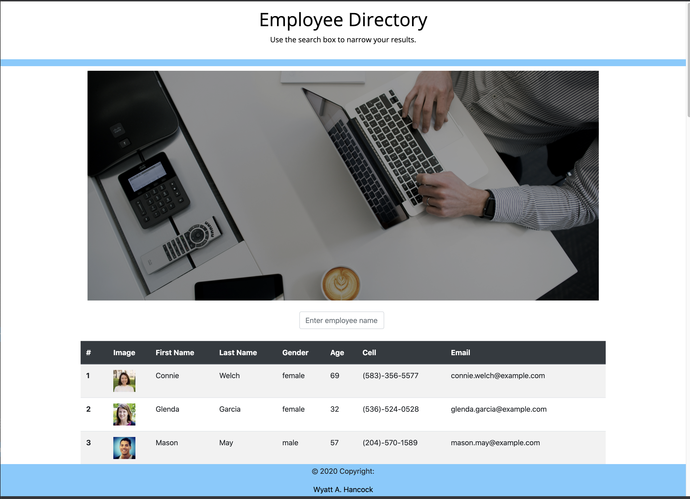

# Employee_Directory_Assign19

# Table of Contents:
1. [Description](#Description)
2. [User Story](#User_Story)
3. [Issues](#Issues)
4. [Improvements](#Improvements)
5. [Link](#Link)
6. [Screenshot](#Screenshot)

## Description
Taking my newfound knowledge of React, I built an application that would allow the user to sort through an employee directory by searching for either a first or last name. 
In order to do this I neeeded to break up the website's UI into components, manage component state, and have the application respond to user events. 

## User_Story
As an enduser, I want to be able to access my employee directory, being able to either view everything at once or search via name so that I can have quick access to non-confidental employee info.

## Issues
* When using the handleInputChange function I was always one letter short in my search. For example, when typing "Joe" the computer would search "Jo". According to the learning assistant Katheryn, this is because I was using this.state.seach the function was not complete and would not search everything. Instead, I needed to utilize event.target.value as it was being updated live.
* Another issue I ran across was that I was displaying two seperate tables, which did not look very professional. In order to fix this I set up a conditional rendering by observing this.state.search and letting the searched table render once this.state.search was no longer empty. The way that I set up the conditional rendering would only allow one table to exist at a time
* The final issue was that in the search if the user started with a lowercase letter it caused all sorts of problems with the "searched" table. In order to fix this I created a variable called uppercase key, which would take the "event.target.value" and make the first letter of the string a capital. This was then ported into the State via this.setState.

## Improvements
* With this being my first React app I was more concerned with building a good app that had a narrower capacity rather than a poor app with a broad capacity. With that said, if I had more time I would like to be able to craft more search perameters so that the user could have more options with searching. Age, gender, phone-number and email would all be good search perameters to add with later iterations.

## Link
[Deployed Link](https://corvus-cyber.github.io/Employee_Directory_Assign19/)

## Screenshot
